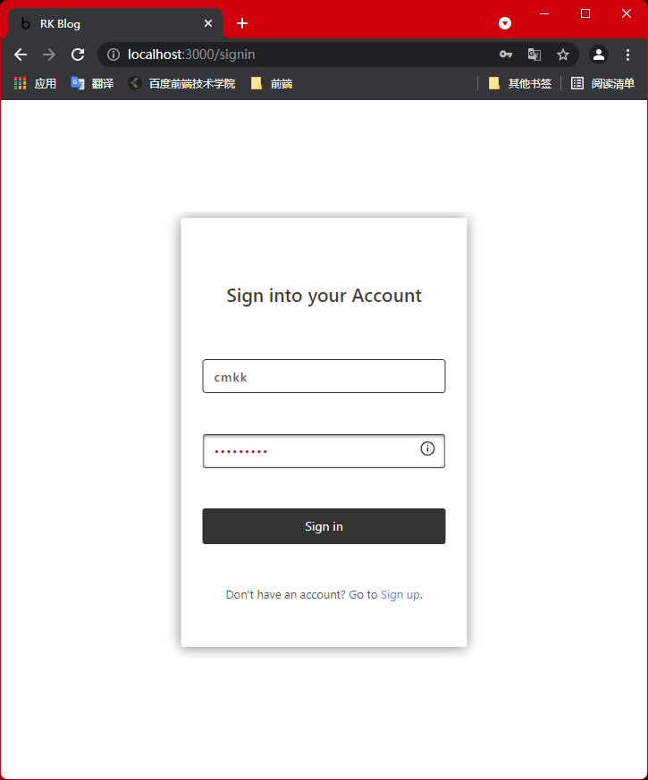

# readme

## 1 启动

* 安装mongoDB，并启动

* 启动RKBlog-server

  ```shell
  # 进入server目录
  npm i
  npm run start
  npm run serve
  
  ```

* 安装项目依赖与启动

  ```shell
  yarn
  yarn start
  ```

  

* 打包编译

  ```shell
  yarn build
  ```

  

## 2 说明

### 2.1 目录结构

```tree
├─assets					静态资源
│  ├─img					图片
│  └─styles					样式文件
├─components				项目组件
│  ├─Article				文章
│  │  ├─ArticleItem			首页文章项
│  │  └─UserArticleItem		用户页文章项
│  ├─Button					按钮组件
│  ├─DropDown				下拉菜单组件
│  ├─Footer					底栏
│  ├─Header					顶栏
│  ├─Input					输入组件，暂未使用
│  ├─Nav					导航组件，暂未使用
│  ├─Tag					文章标签组件
│  ├─TipBtn					提示按钮组件
│  ├─ToolBtn				工具按钮组件
│  └─Upload					图片上传组件
├─data						常量数据
├─hooks						自定义钩子
├─interface					类型与接口
├─pages						页面
│  ├─App					路由
│  ├─Article				文章相关
│  │  ├─Add					文章添加
│  │  ├─Edit				文章编辑
│  │  └─View				文章预览
│  ├─Home					首页
│  ├─NotFound				404页面
│  ├─Search					搜索页
│  ├─Sign					登录与注册
│  │  ├─SignIn				登录
│  │  └─SignUp				注册
│  └─Space					用户页
├─services					项目api
├─store						状态管理
└─utils						工具
```

### 2.2 项目功能

见**[文档](./docs/srs.md)**.

示例账户：

```
account: admin
pwd: r12345
```

**注意**：*本项目虽然依赖了`antd`，但是除了分页组件`Pagination`与全局提示组件`message`外，其他组件均为使用（为此可以使用自己的组件，以及更好的书写样式），所以在项目表单部分的交互有些许简陋，如登录注册等，不过我已实现了一个提示组件`TipBtn`(被圆圈包裹的倒置感叹号，鼠标悬停即可显示提示信息)以及invalid样式，在用户输入时提示用户输入满足要求的表单数据。*

### 2.3 效果展示

1. 登录（注册页效果与登录页类似，在此不再展示）

   

   

   

2. 主页

   

   

   

   

   

3. 首页

   

   

4. 搜索

   

   

5. 文章

   

   

   
   
6. 顶栏

   

   

## 开发日记

### 08-09

1. 完成登录与注册页面的开发；

2. 按需引入antd样式遇到问题，尝试使用以前的配置解决，但均无法解决。思考再三，想起`getStyleLoaders`不兼容less5.0.0以后的版本，而以前的解决方法是：

```js
options: {
   lessOptions: {
      javascriptEnabled: true
   }
}
```

而5.0.0前版本的对应配置为：

```js
options: {
   javascriptEnabled: true
}
```

3. 构建space与主页框架。


### 08-10

1. 调试服务器文章相关api，修改前端配置，解决参数无法读取的问题。

```json
// header中的
'Content-Type': 'application/json';
// 直接上传对象，不用stringfy
```
详情见[koa-body处理请求](https://juejin.cn/post/6844903618244509703)

2. 调试bytemd部分代码，实现图片上传与预览功能。

3. 添加ArticleItem.


### 08-11

1. 构建主页结构，实现部分功能。（按时间排序的功能还没做）

2. 构建预览页，调整了样式。

3. 自定义几个钩子，实现部分逻辑复用。

4. 明日计划：完成文章编辑页与新建页，实现主页排序，架设个人主页。

### 08-16

一个不小心，中间掉了五天没写，不要问为啥没写，问就是写代码太投入（其实是在边写代码边摸鱼看比赛，然后事情一多就忘了）。
五天中的前三天主要精力集中在大页面的搭建上，也就是建毛坯房。后两天主要工作是调节样式与交互上的一些细节问题，添加了很多动画，将很多重复的部分提取为组件放置到components中；以及debug，根据需求修改服务器代码，因为原服务器代码部分功能不能很好的满足需求（就在刚刚，郑永可在群里说解决了这些问题————唉，要是早点就好了，我就不用自己改了）。
现在是8月16号的晚上11点53分，我刚刚改好登录与注册界面的样式。
看着这个页面，我会想起一周前刚开始写它的时候的情形————在网上到处看设计图找灵感，企图写一个灵动的页面，最终我花了将近一天的时间来抠这个界面，最后还是不满意。而现在，它被改得面目全非，简直妈都不认识。想到这里，我忍不住笑了。

好了，简言之，就是项目的大体工作已经完成，在此记录一下。


### 08-17

今日完善许多之前未考虑到的小问题，有样式上的，也有逻辑上的。

最终效果见项目readme 章节2.3。

我宣布，这个项目就此完结，鼓掌！